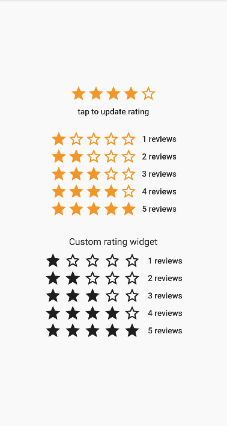
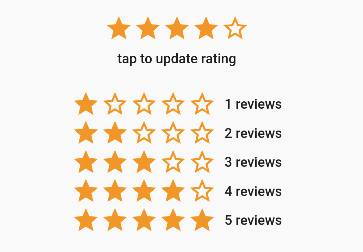

A simple awesome rating widget for flutter which also include fully customizaable, supporting any fraction of rating.

##Features
- Set minimum and maximum rating
- Any widgets can be used as as rating bar/indicator items
- Different widgets can be used in same rating bar as per position

```dart
                AwesomeStarRating(
                  starCount: 5,
                  rating: 5.0,
                  size: 30.0,
                  color: Colors.orange,
                  borderColor: Colors.orange,
                ),
```
#### AWESOME RATING


```dart
                AwesomeStarRating(
                  starCount: 5,
                  rating: 5.0,
                  size: 30.0,
                  onRatingChanged: (double value){
                  setState((){
                    rating = value;
                      });
                    },
                  color: Colors.orange,
                  borderColor: Colors.orange,
                ),
```
#### AWESOME RATING value change
